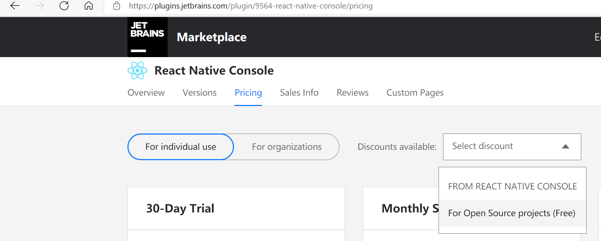

If you are a students or open source developer as described here: [https://www.jetbrains.com/store/?#discounts?billing=yearly](https://www.jetbrains.com/store/?#discounts?billing=yearly)  .Please go to [https://plugins.jetbrains.com/plugin/9564-react-native-console/pricing](https://plugins.jetbrains.com/plugin/9564-react-native-console/pricing) , there should be a discount there like something says for Student(Free). 
    If you still have issues, I can using another way to generate a coupon code, mail to me beansoft@126.com

    

### Important Note: Pricing and the old Free version

Since version 2020.2 the plugin is changed to a paid version. Previous versions are still available for free, but further updates will only be available on the Paid Version.

FREE or discount provided: this latest paid version plugin provides the same offer as Jetbrains' <a href="https://www.jetbrains.com/community/education/#students">Special Offers</a>, so For students and teachers, For classroom assistance, For Open Source projects, it's free. You can mail me to apply it in case you meet the condition. 

The old open sourced free version could be download here:

[https://plugins.jetbrains.com/plugin/15016-react-native-console-free](https://plugins.jetbrains.com/plugin/15016-react-native-console-free)

Also you can search  `React Native Console Free` in your IDEA/WebStorm/Android Studio plugin page to install it.

The free version contains all the features at version React Native Console 2020.1.0.
